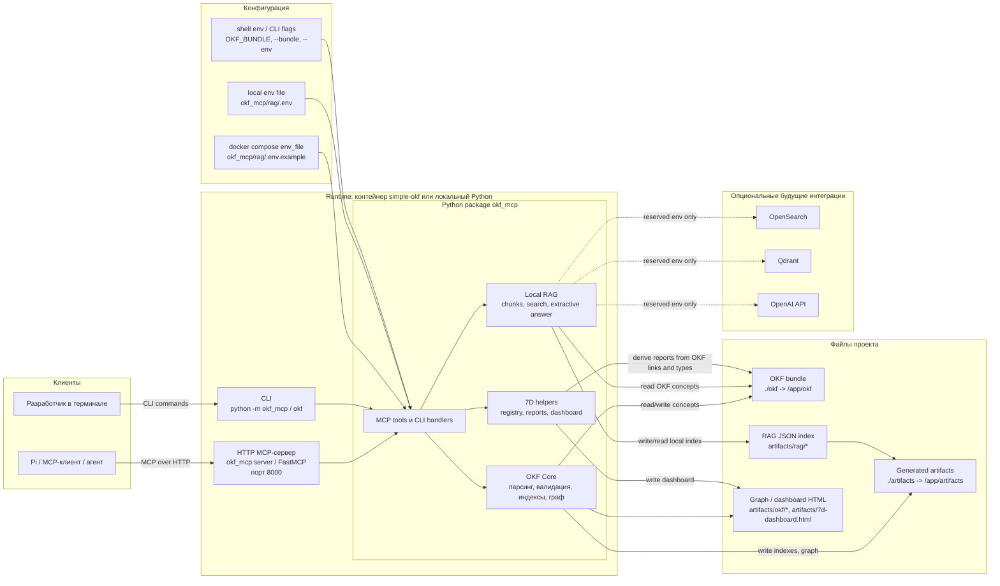

<div align="center">

# Simple OKF Template

**Локальный шаблон и MCP-инструменты для ведения agent-readable knowledge bundle в Open Knowledge Format.**

[](https://github.com/18studio/simple_okf)
[](https://github.com/18studio/simple_okf/issues)
[](https://github.com/18studio/simple_okf/pulls)
[](https://github.com/18studio/simple_okf/commits/master)
[](./pyproject.toml)

</div>

## Что это

Короче: клонируешь и запускаешь в своём AI-окружении. Я использую Pi.

Есть навык (skill): вызываешь его и можешь в правильном формате создавать документы, собирать контекст и искать через MCP.

В MCP есть команды для дискретных действий и поиска по RAG.

RAG помогает искать по ID и содержанию. Это особенно полезно, если запускать субагентов и для каждого прохода вытаскивать контекст документов.

## Локальный запуск

### Требования

- Python 3.10+
- [`uv`](https://docs.astral.sh/uv/)
- `make` — опционально, но удобнее для типовых команд

### Быстрый старт

```sh
git clone git@github.com:18studio/simple_okf.git
cd simple_okf
make init
```

`make init` установит зависимости через `uv`, создаст локальный `okf_mcp/rag/.env` из примера, проверит OKF-бандл и обновит локальный RAG-индекс.

Если `make` не нужен, те же шаги можно выполнить вручную:

```sh
uv sync
cp okf_mcp/rag/.env.example okf_mcp/rag/.env
uv run python -m okf_mcp validate okf
uv run python -m okf_mcp rag inspect --pretty
uv run python -m okf_mcp rag refresh --pretty
```

### Запуск MCP-сервера

Для stdio-транспорта:

```sh
uv run python -m okf_mcp server --bundle okf
```

Для HTTP-транспорта:

```sh
uv run python -m okf_mcp server --bundle okf --transport http --host 127.0.0.1 --port 8000
```

В Pi и других MCP-клиентах можно использовать готовую конфигурацию из [`.mcp.json`](./.mcp.json): сервер называется `simple-okf`.

### Запуск через Docker Compose

Если не хочется ставить Python/uv локально, можно поднять HTTP MCP-сервер через Docker Compose:

```sh
docker compose up --build
```

Сервис слушает `http://127.0.0.1:8000`. Compose не поднимает внешние сервисы вроде OpenSearch, Qdrant или OpenAI: текущий RAG работает локально с OKF-бандлом и JSON-артефактами.

Compose загружает переменные из [`okf_mcp/rag/.env.example`](./okf_mcp/rag/.env.example) через `env_file`.

Подключены локальные директории:

- `./okf` → `/app/okf`
- `./artifacts` → `/app/artifacts`

Остановить сервис:

```sh
docker compose down
```

### Переменные окружения

Основной локальный env-файл для RAG — `okf_mcp/rag/.env`. Он создаётся из примера [`okf_mcp/rag/.env.example`](./okf_mcp/rag/.env.example) и не должен попадать в git:

```sh
cp okf_mcp/rag/.env.example okf_mcp/rag/.env
```

Для разового запуска RAG с другим env-файлом используйте флаг `--env`:

```sh
uv run python -m okf_mcp rag inspect --env /path/to/.env --pretty
```

| Переменная | Где задаётся | Значение в `.env.example` | Описание |
|---|---|---|---|
| `OKF_BUNDLE` | shell env / Compose `env_file` | `okf` | Путь к OKF-бандлу для MCP-сервера, если не передан `--bundle`. |
| `RAG_BUNDLE_DIR` | `okf_mcp/rag/.env` / Compose `env_file` | `okf` | OKF-бандл, который RAG-инструменты инспектируют, индексируют и по которому ищут. Относительные пути считаются от корня репозитория при CLI-запуске и от `/app` при Docker Compose. Директория должна существовать. |
| `RAG_ARTIFACTS_DIR` | `okf_mcp/rag/.env` / Compose `env_file` | `artifacts/rag` | Директория для локальных RAG-артефактов. Должна резолвиться внутрь директории `artifacts/`. |
| `RAG_RETRIEVAL_RESULT_LIMIT` | `okf_mcp/rag/.env` / Compose `env_file` | `10` | Количество результатов по умолчанию для `rag retrieve`, если не передан `--limit`. Значение должно быть целым числом `>= 1`. |
| `RAG_ANSWER_EVIDENCE_LIMIT` | `okf_mcp/rag/.env` / Compose `env_file` | `5` | Количество фрагментов-доказательств для extractive-ответа RAG. Значение должно быть целым числом `>= 1`. |
| `RAG_OPENSEARCH_URL` | `okf_mcp/rag/.env` / Compose `env_file` | пусто | Зарезервировано для OpenSearch в будущей indexed RAG-интеграции. В Docker Compose по умолчанию пусто, потому что внешний OpenSearch не запускается и текущий локальный поиск его не использует. |
| `RAG_QDRANT_URL` | `okf_mcp/rag/.env` / Compose `env_file` | пусто | Зарезервировано для Qdrant в будущем векторном индексе. В Docker Compose по умолчанию пусто, потому что внешний Qdrant не запускается и текущий локальный поиск его не использует. |
| `OPENAI_API_KEY` | `okf_mcp/rag/.env` / Compose `env_file` | пусто | Зарезервированный секрет для будущей generative RAG-интеграции. Не коммитьте реальное значение. В Docker Compose по умолчанию пусто, потому что OpenAI не нужен для текущего локального поиска. |
| `RAG_EMBEDDING_MODEL` | `okf_mcp/rag/.env` / Compose `env_file` | пусто | Зарезервировано: модель эмбеддингов для будущей generative/indexed RAG-интеграции. |
| `RAG_EMBEDDING_DIMENSIONS` | `okf_mcp/rag/.env` / Compose `env_file` | пусто | Зарезервировано: размерность эмбеддингов для будущего векторного индекса. |
| `RAG_GENERATION_MODEL` | `okf_mcp/rag/.env` / Compose `env_file` | пусто | Зарезервировано: модель генерации ответов для будущей generative RAG-интеграции. |
| `RAG_REPHRASER_MODEL` | `okf_mcp/rag/.env` / Compose `env_file` | пусто | Зарезервировано: модель переформулирования запросов для будущей generative RAG-интеграции. |

### HLD-схема сервиса

Simple OKF — это один локальный Python-сервис с MCP API и CLI-командами поверх файлового OKF-бандла. В Docker Compose поднимается только контейнер `simple-okf`; OpenSearch, Qdrant и OpenAI не требуются для текущего локального поиска.



На схеме:

- **MCP-сервер** — основной сервис для Pi и других MCP-клиентов.
- **CLI** — тот же функциональный слой для локальных команд и fallback-сценариев.
- **OKF Core** — работа с Markdown-концептами в `okf/`.
- **Local RAG** — локальный поиск по OKF-концептам без внешней базы и без LLM API.
- **Generated artifacts** — производные файлы; каноничным источником знаний остаётся `okf/`.

### Полезные команды

```sh
make validate       # проверить Python-модули и OKF-бандл
make indexes        # пересобрать okf/**/index.md
make graph          # собрать artifacts/okf/graph.json и graph.html
make rag-check      # проверить и обновить локальный RAG-индекс
make 7d-report      # вывести компактный отчет по 7D-стадиям
make 7d-dashboard   # собрать artifacts/7d-dashboard.html
```

## Документация

- LLM-контракт проекта: [SPEC.md](./SPEC.md)
- Правила для агентов: [AGENTS.md](./AGENTS.md)
- Основной OKF-бандл: [`okf/`](./okf/)
- MCP и CLI: [`okf_mcp/`](./okf_mcp/)

Если что, пишите issues и предлагайте PR.

Коля
